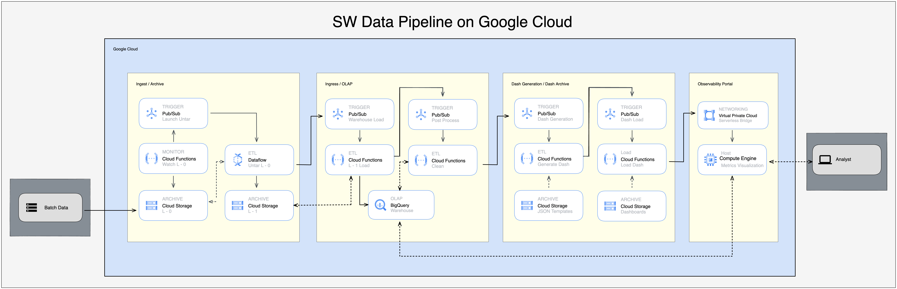

# ACEP SW Data Pipeline Overview: GCP Bucket Event-Driven Processing For Archiving, On Line Analytical Processing, And Data Visualization.

Welcome to the Alaska Center for Energy and Power (ACEP) ASAPSW Data Pipeline repository. This repository centralizes documentation and links for a series of interconnected Google Cloud Platform (GCP) components designed to automate and streamline the processing of `.tar.gz` archives arriving in a designated GCP bucket. Beyond the initial processing, this pipeline system offers capabilities for archival storage, advanced data wrangling to shape and transform the data, and the automated generation of visualizations to offer immediate insights from the ingested data.

## Workflow Overview:

## Archiving

1. **Archive Arrival & Notification**:
    - A `.tar.gz` archive is uploaded to a specific GCP bucket.
    - A Cloud Function watches this bucket. Upon the arrival of a `.tar.gz` file, it broadcasts a message via Eventarc to Pub/Sub.

2. **Data Flow Extraction**:
    - A Dataflow job, which is subscribed to the Pub/Sub topic, triggers upon receiving the message. 
    - It unpacks the `.tar.gz` archive, processing its contents.

3. **Secondary Archiving & Notification**:
    - After unpacking, the Dataflow job stores the unpacked payload in a secondary GCP bucket, preserving the contents in their unpacked state.
    - Once this is completed, another message is broadcast to Pub/Sub, signaling that the next stage in the data pipeline can commence.

This design ensures a seamless, event-driven flow where each component is triggered based on specific conditions, ensuring efficient and timely processing. The original `.tar.gz` archive remains untouched in the initial bucket, serving as an immutable record, while the unpacked contents are made available for further processing in the secondary bucket.

## ETL Processing & BigQuery Storage:

1. **BigQuery Ingestion**:
    - Once the unpacked data is stored in the secondary GCP bucket, a Cloud Function is triggered.
    - This function initiates an Extract, Transform, and Load (ETL) job that ingests the unpacked data into a BigQuery table.

2. **Initial Data Validation**:
    - As the data is ingested into BigQuery, a set of validation rules are applied to ensure data consistency and quality.
    - Any records that don't meet the predefined standards are logged for further analysis and correction.

3. **Data Reshaping & Cleaning**:
    - Post initial validation, a separate job runs to reshape the data for optimal querying. This includes operations like normalization, deduplication, and data type casting.
    - Additionally, known data quality issues, if any, are addressed, ensuring that the final stored data is clean and reliable.

4. **Completion Notification**:
    - After the cleaning and reshaping tasks are complete, a message is broadcast via Pub/Sub. This message signals that the data is ready for analytical processes and visualization generation.

This segment of the pipeline is focused on ensuring that the data is not only stored but is also in an optimal format for any downstream analytical tasks. By using BigQuery, the system takes advantage of its scalable storage and fast querying capabilities, while also ensuring that the data is reliable and of high quality.

## Data Visualization & Grafana Integration:

1. **Dashboard Template Retrieval**:
    - Once data is cleaned and reshaped in BigQuery, a trigger is set off to fetch a predefined dashboard template.
    - This template contains placeholders for the most recent data and metrics deemed critical for monitoring.

2. **Dashboard Population**:
    - The template is populated with the most recent data from BigQuery.
    - Using automated scripts, the required metrics are extracted, and the template is filled accordingly, producing a live dashboard reflecting the latest data trends.

3. **Grafana VPC Integration**:
    - With the dashboard ready, it's pushed to Grafana through a secure VPC (Virtual Private Cloud) connection.
    - This ensures that the data remains secure, and the visualization is only accessible to authorized personnel.

4. **Completion & Accessibility**:
    - Post integration, a notification is sent to the relevant stakeholders informing them of the updated dashboard.
    - They can now access the latest visualizations on Grafana, providing them with real-time insights derived from the freshly processed data.

This stage of the pipeline emphasizes the importance of real-time data visualization. By automating the process from data processing in BigQuery to visualization in Grafana, stakeholders can receive up-to-date insights with minimal delay, aiding in informed decision-making.

---

### Core Repositories:

1. [sw-cf-bq-gr-dash-gen](https://github.com/acep-uaf/sw-cf-bq-gr-dash-gen)
2. [sw-cf-bq-gr-dash-load](https://github.com/acep-uaf/sw-cf-bq-gr-dash-load)
3. [sw-cf-gcs-untar](https://github.com/acep-uaf/sw-cf-gcs-untar)
4. [sw-cf-gcs-ps-bq](https://github.com/acep-uaf/sw-cf-gcs-ps-bq)
5. [sw-cf-bq-pp](https://github.com/acep-uaf/sw-cf-bq-pp)
6. [sw-df-untar-gcs](https://github.com/acep-uaf/sw-df-untar-gcs)
